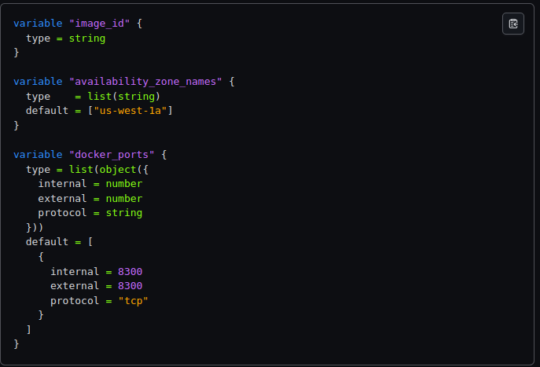

# Variáveis no Terraform

https://developer.hashicorp.com/terraform/language/values/variables

As variáveis no Terraform permitem parametrizar a configuração, tornando-a mais dinâmica e reutilizável. Você pode definir variáveis no Terraform para armazenar valores que podem ser referenciados em vários lugares na configuração, como IDs de imagens, nomes de zonas de disponibilidade, portas de contêineres, etc...

O Terraform carrega variáveis ​​na seguinte ordem, com fontes posteriores tendo precedência sobre as anteriores:

- Variáveis ​​ambientais
- O `terraform.tfvars`, se presente.
- O `terraform.tfvars.json`, se presente.
- Qualquer `*.auto.tfvars` ou `*.auto.tfvars`, processados ​​na ordem lexical de seus nomes de arquivo.
- Quaisquer `-var` `-var-file` na linha de comando, na ordem em que são fornecidas. (Isso inclui variáveis ​​definidas por um espaço de trabalho do HCP Terraform.)

